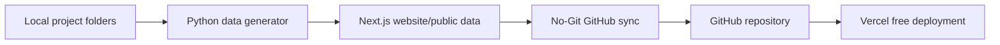

# Vercel Deployment Guide

## Recommended Free Architecture



## What Is Free

- Next.js source code: free
- GitHub repository sync: free
- Vercel free plan hosting: free for normal personal/project use
- Static project dashboard pages: free

## What Is Not Live On Vercel

Vercel cannot read your local Windows folder directly:

```text
C:\Users\pc\OneDrive\Documents\Project Intelligence Hub\projects
```

The local generator converts the project folder data into website files, then GitHub sync sends them to the repository.

## Commands

Generate website data:

```powershell
cd "D:\Project Intelligence Hub NextJS"
python tools\generate_nextjs_website_data.py
```

Run locally:

```powershell
cd "D:\Project Intelligence Hub NextJS\website"
npm install
npm run dev
```

Sync to GitHub:

```powershell
cd "D:\Project Intelligence Hub NextJS"
cmd /c RUN_FULL_PROJECT_NO_GIT_SYNC.bat Once 30
```

## Vercel Settings

| Setting | Value |
| --- | --- |
| Framework | Next.js |
| Root Directory | `website` |
| Build Command | `npm run build` |
| Install Command | `npm install` |
| Output Directory | `.next` |

## Update Cycle

1. Update project files locally.
2. Run the generator or run `npm run build` from the website folder.
3. Run `RUN_FULL_PROJECT_NO_GIT_SYNC.bat Once 30`.
4. Vercel rebuilds from GitHub.
5. Public website reflects the update.
