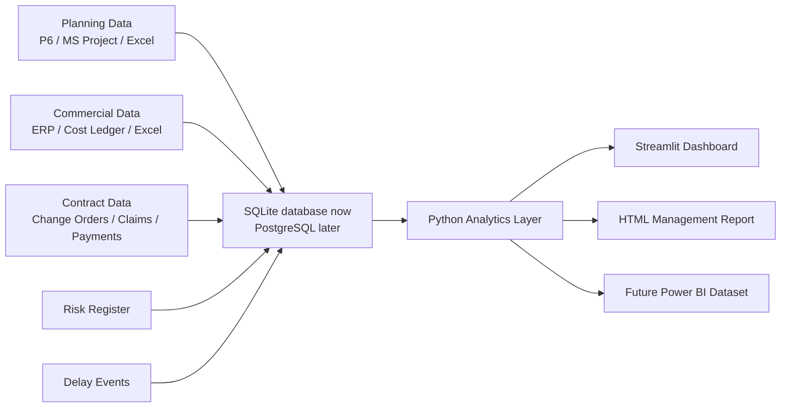

# System Blueprint

## Objective

Create an integrated construction project system that connects the database, project controls, contract management, delay analysis, risk analysis, reporting, and dashboards.

## Recommended Architecture

## Roles Supported

- Project Manager: executive snapshot, schedule/cost health, risks, commercial exposure.
- Planning Manager: activities, progress variance, critical activities, milestones, delay events.
- Contract Manager: change orders, claims, payment status, notice dates, EOT position.
- Commercial Manager: BAC, EV, AC, CPI, EAC, variations, certified unpaid amounts.
- Risk Manager: risk exposure, severity, owners, mitigation actions.

## Database Strategy

Version 1 uses SQLite because it is simple and local. For a real multi-user project, move to PostgreSQL with:

- User permissions
- Audit trail
- File attachments
- Scheduled data imports
- Role-based dashboards
- Backups

## Data Integration Plan

1. Export source data to CSV using the files in `data/import_templates`.
2. Import CSV files with `scripts/import_csv_data.py`.
3. Validate data relationships:
   - Activity IDs in delay events must exist in `activities`.
   - Contract IDs in claims/payments/change orders must exist in `contracts`.
   - WBS IDs in cost and activity records must exist in `wbs`.
4. Run the dashboard or generate the HTML report.

## Delay Analysis Roadmap

Current version provides a management-level first-pass delay assessment:

- Event duration
- Impacted critical activity
- Concurrent delay flag
- Responsibility
- Potential EOT view

Future forensic methods:

- Time Impact Analysis
- Windows Analysis
- As-Planned vs As-Built
- Collapsed As-Built
- Concurrent delay apportionment

## Reporting Roadmap

Version 1:

- Streamlit dashboard
- Static HTML report

Version 2:

- Excel report pack
- PDF monthly report
- Power BI dataset export
- Automated contract notice alerts

