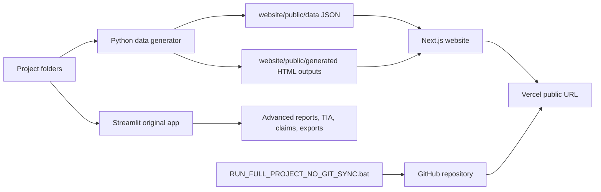

# Project Intelligence Hub - Comprehensive App Guide

Generated: 2026-07-27 18:14

Live website: https://samcoegyptdashboard.vercel.app

Figma reference design: https://www.figma.com/design/z1T4ERNeuBlrpC3slf93KT

## 1. Executive Summary

Project Intelligence Hub is a project-controls, delay-analysis, claims-intelligence, and executive-reporting system. It currently has two working surfaces:

- Original Streamlit app: the full Python application, advanced calculations, uploads, exports, and detailed project-controls workflows.
- Next.js/Vercel website: public, fast, mobile-friendly executive website generated from the same project folders and HTML outputs.

The main operating rule is project isolation: each selected project reads from its own project folder, shows its own data, and writes or publishes its own outputs.

## 2. Current Portfolio Snapshot

- Projects detected: 4
- Sectors detected: 3
- Total contract value: EGP 4,200,000,000
- Average progress: 100.0%
- Average SPI: 0.75
- Average CPI: 60.11
- Decisions required: 1

| Project | Sector | Status | Contract Value | Progress | Activities | Decision Required |
| --- | --- | --- | --- | --- | --- | --- |
| LMD Bridge & Road Interchange | Bridges | Delayed | EGP 850,000,000 | 100.0% | 17 | No |
| ROYA-BIG PROJECT PHASE01 (B1-4) | Buildings | Active | EGP 0 | 100.0% | 1363 | Yes |
| Sophia Mall Mixed-Use Development | Buildings | On Track | EGP 2,100,000,000 | 100.0% | 17 | No |
| Suez Tunnel Civil & MEP Works | Tunnels | Delayed | EGP 1,250,000,000 | 100.0% | 17 | No |

## 3. Sector Structure

Projects are grouped by sector folders under `projects`. Adding a new sector folder automatically creates a new sector in the Decision Making Dashboard after the generator runs.

| Sector | Projects | Contract Value | Progress | SPI | CPI | Decisions |
| --- | --- | --- | --- | --- | --- | --- |
| Bridges | 1 | EGP 850,000,000 | 100.0% | 1.0 | 78.3 | 0 |
| Buildings | 2 | EGP 2,100,000,000 | 100.0% | 0.5 | 41.92 | 1 |
| Tunnels | 1 | EGP 1,250,000,000 | 100.0% | 1.0 | 78.3 | 0 |

## 4. High-Level Architecture



## 5. Main User Flow

1. Open the website.
2. Decision Making Dashboard appears first.
3. Choose a project from the Active Project dropdown.
4. The same page updates the Project Workspace tabs.
5. Use the old-app-style tabs for Overview, EBS/WBS, Activities, Milestones, S-Curve, EVM, Contracts, Risk Matrix, Letters Intelligence, Delay Analysis, Contract & Claims, Conference, and Output Studio.
6. Update source files in the selected project folder.
7. Run the website data generator and sync.
8. Vercel updates the public dashboard from GitHub.

## 6. App Tabs and Features

| Tab / Page | Purpose | Main Data or Behavior |
| --- | --- | --- |
| Decision Making Dashboard | Top-management portfolio view | Aggregates all project JSON into portfolio KPIs, sector view, project console, and report viewer. |
| Overview | Project executive summary | Shows project status, value, progress, remaining value, source metadata, and overview table. |
| EBS / WBS | Work breakdown view | Shows WBS source table and master dashboard embed for the selected project. |
| Activities | Activity register | Shows activity, progress, EVM, and delay event counts with source-table preview. |
| Milestones | Milestone tracking | Shows milestone records, SPI schedule health, delay days, and milestone source table. |
| S-Curve | Progress trend | Shows S-curve source status and linked executive dashboard HTML. |
| EVM | Earned value management | Calculates BAC, PV, EV, AC, SPI, CPI from selected project data. |
| Contracts | Commercial position | Shows contract value, paid, spent, remaining value, contracts and payments previews. |
| Risk Matrix | Risk and decision signals | Shows risk score, risk rows, decision trigger, delay exposure, and risk table. |
| Letters Intelligence | Correspondence intelligence | Detects inbox files and workbook, shows letter inventory and generated dashboard output. |
| Delay Analysis | Time Impact Analysis | Detects TIA templates, missing files, column previews, MEP schedule, BL schedule, and generated delay charts. |
| Contract & Claims | Claims knowledge base | Detects contract files, clause library, SQLite tables, evidence, and claim exposure. |
| Conference | Meeting support | Reads meeting_url from project.json and provides same-page conference panel and join button. |
| Output Studio | Generated reports | Shows four automatic HTML outputs and watcher/sync status for the selected project. |

## 7. Folder Guide

| Folder / File Area | Purpose | How It Is Used |
| --- | --- | --- |
| projects/{Sector}/{Project} | Main project workspace | Add future projects here under sector folders. The generator detects them automatically. |
| 01-data/import_templates | Core project data | CSV files for projects, activities, progress, EVM, payments, contracts, claims, risks, milestones, WBS, S-curve. |
| 02-delay_analysis | TIA workspace | Methodology documents and steel_delay_tia_templates CSVs used by Delay Analysis. |
| 03-schedule | Schedule support | BL Schedule, MEP Schedule, MEP Activities, and civil logic files. |
| 04-source_excel | Raw Excel source | Original Excel files before conversion into controlled CSV inputs. |
| 05-contracts | Contract intelligence | Contract source PDFs, clause libraries, contract_claims.db, and clauses. |
| 06-evidence | Evidence register | Evidence templates, photo logs, document references, and claim evidence. |
| 07-letters_intelligence | Correspondence intelligence | letters_intelligence.xlsx plus inbox folders for new letters. |
| 08-branding | Project branding | Logo placeholder, identity, palette, and report branding templates. |
| 09-notes | Project notes | Meeting, engineering, and claims notes. |
| 10-deliverables | Formal deliverables | Generated project deliverables outside the automatic website HTML output set. |
| 11-outputs | Automatic HTML outputs | Per-project generated HTML outputs: executive, master, SVG charts, linked dashboard. |
| 12-logs | Project logs | Project-specific operational logs. |
| website | Next.js public site | Vercel website source, React UI, CSS, and public data. |
| tools | Automation tools | Data generator, GitHub no-Git sync, validation, lineage, and package builders. |
| src/construction_system | Python backend logic | Streamlit support modules, project context, loaders, TIA logic, reporting, OpenAI gateway. |
| dashboard.py | Original Streamlit app | The full original application with Python-based calculations and advanced workflows. |

## 8. Project Folder Standard

Every project should live at:

`projects/{Sector Name}/{Project Folder Name}`

Minimum files:

- `project.json`
- `project_manifest.json`
- `01-data/import_templates/*.csv`
- `02-delay_analysis/steel_delay_tia_templates/*.csv`
- `03-schedule/*.csv`
- `05-contracts/source/*`
- `07-letters_intelligence/inbox/*`

Recommended `project.json` fields:

```json
{
  "project_id": "unique-project-id",
  "project_name": "Visible Project Name",
  "client_name": "Client",
  "contractor": "SAMCO",
  "currency": "EGP",
  "status": "Active",
  "meeting_url": "https://your-meeting-link"
}
```

## 9. Data Pipeline

The website data pipeline is:

Project folders -> `tools/generate_nextjs_website_data.py` -> `website/public/data/portfolio.json` and `website/public/data/projects/*.json` -> Next.js UI.

The generator also copies automatic HTML outputs from root `11-outputs/{Project Folder Name}` into `website/public/generated/{Project Folder Name Slug}`.

## 10. Automatic HTML Outputs

Each project should have exactly these automatic website HTML outputs:

| File | Name | Purpose |
| --- | --- | --- |
| 01_executive_dashboard.html | Executive dashboard | Project-level management dashboard HTML. |
| 02_master_dashboard.html | Master dashboard | Detailed project dashboard by sections. |
| 03_elite_svg_charts.html | Elite SVG charts | Tabbed SVG chart gallery generated as HTML. |
| 04_linked_executive_dashboard.html | Linked executive dashboard | Linked A3-style executive dashboard HTML. |

## 11. Letters Intelligence

Letters Intelligence is project-scoped. The website detects:

- `07-letters_intelligence/letters_intelligence.xlsx`
- `07-letters_intelligence/inbox/**`
- letter file count, extension, size, modified date
- linked claims and delay-event availability

To add new letters, place them in the selected project inbox folder, then regenerate and sync.

## 12. Delay Analysis - Time Impact Analysis

Delay Analysis reads project-specific TIA templates from:

`02-delay_analysis/steel_delay_tia_templates`

The website detects the file inventory, row count, column count, missing required files, MEP activities, MEP schedule, MEP civil logic, and BL schedule. The original Streamlit app remains the full calculation engine for deep TIA exports and report generation.

## 13. Contract & Claims Intelligence

Contract & Claims uses:

- `05-contracts/source`
- `05-contracts/source/Overall_Contract_clause_library.xlsx`
- `05-contracts/contract_claims.db`
- `06-evidence`

The website shows file inventory and knowledge-base table counts. The original Streamlit app remains the advanced claims engine for extraction, evidence mapping, rebuttal, claim drafting, and exports.

## 14. Conference Call

The Conference tab reads `meeting_url` from the selected project's `project.json`.

If the field is missing, the tab shows setup instructions. If the field exists, it shows a Join Conference button.

Teams and Zoom usually block iframe embedding, so the meeting may open in a new tab while the dashboard remains available.

## 15. Output Studio

Output Studio shows the four automatic HTML reports and sync/watch status. Manual Streamlit output features still exist in the original app. The Next.js website focuses on fast HTML report viewing and mobile-safe access.

## 16. Sync and GitHub

The no-Git sync is controlled by:

- `RUN_FULL_PROJECT_NO_GIT_SYNC.bat`
- `tools/github_no_git_sync.ps1`
- `tools/github_sync_config.json`

Repository target:

- Owner: ahmedlabib33-boop
- Repository: Samco-Project-Intelegent-Hub
- Branch: main
- Default interval seconds: 30
- Deletion sync: True

Credentials must come from `GITHUB_TOKEN` or `GH_TOKEN` in the local Windows process.

## 17. Vercel Deployment

Recommended Vercel settings:

- Root directory: `website`
- Framework: Next.js
- Build command: `npm run build`
- Install command: `npm install`
- Output directory: `.next`

Production URL:

`https://samcoegyptdashboard.vercel.app`

## 18. Common Commands

| Action | Command |
| --- | --- |
| Generate website data | cd "D:\Project Intelligence Hub NextJS" && python tools\generate_nextjs_website_data.py |
| Run website locally | cd "D:\Project Intelligence Hub NextJS\website" && npm run dev |
| Build website | cd "D:\Project Intelligence Hub NextJS\website" && npm run build |
| Deploy to Vercel | cd "D:\Project Intelligence Hub NextJS\website" && npx vercel@latest deploy --prod --yes --project samcoegyptdashboard |
| Sync to GitHub once | cd "D:\Project Intelligence Hub NextJS" && cmd /c RUN_FULL_PROJECT_NO_GIT_SYNC.bat Once 30 |
| Start sync watcher | cd "D:\Project Intelligence Hub NextJS" && cmd /c RUN_FULL_PROJECT_NO_GIT_SYNC.bat Watch 30 |

## 19. Adding a New Project

1. Create a sector folder under `projects` if needed.
2. Copy `_PROJECT_TEMPLATE` into the sector folder.
3. Rename the copied folder to the project name.
4. Edit `project.json` and `project_manifest.json`.
5. Add project CSVs under `01-data/import_templates`.
6. Add TIA files under `02-delay_analysis/steel_delay_tia_templates`.
7. Add schedule support under `03-schedule`.
8. Add contracts under `05-contracts/source`.
9. Add letters under `07-letters_intelligence/inbox`.
10. Run the generator.
11. Build and sync.

## 20. Update Workflow

When project files change:

1. Update the files in the correct project folder.
2. Run `python tools\generate_nextjs_website_data.py`.
3. Run `npm run build` from `website`.
4. Run `RUN_FULL_PROJECT_NO_GIT_SYNC.bat Once 30`.
5. Vercel rebuilds from GitHub.

## 21. Troubleshooting

| Issue | Likely Cause | Fix |
| --- | --- | --- |
| Project not visible | Folder not under sector folder or generator not run | Place folder under `projects/{Sector}` and rerun generator |
| Website shows old data | JSON not regenerated or GitHub/Vercel not updated | Run generator, sync, redeploy |
| Conference button missing | `meeting_url` missing in `project.json` | Add meeting URL and regenerate |
| Letters not detected | Files not in project inbox | Add files under `07-letters_intelligence/inbox` |
| Delay tab missing files | Required TIA CSVs absent or named differently | Add files to `02-delay_analysis/steel_delay_tia_templates` |
| Claims data looks empty | Contract source or DB missing | Add contract source files and rebuild contract library in Streamlit |
| Sync fails 401 | Token not available in process scope | Set `GITHUB_TOKEN` or `GH_TOKEN` in the active Windows environment |
| Vercel build warning about audit | Dev-package audit noise | Check production audit with `npm audit --omit=dev` |

## 22. Maintenance Rules

- Do not mix project data between folders.
- Do not hardcode project names in the website UI.
- Use `project.json` for project identity and meeting links.
- Use CSV files as the source of visible project data.
- Regenerate website JSON after source changes.
- Keep automatic outputs as HTML in per-project output folders.
- Keep credentials outside the repository.
- Use the Streamlit app for deep Python workflows and the Next.js site for public/mobile viewing.

## 23. Roadmap

Recommended next improvements:

1. Add a backend API if live online uploads and AI extraction are required on Vercel.
2. Add project-level authentication if dashboard access must be private.
3. Add scheduled GitHub/Vercel automation for automatic rebuilds.
4. Add Playwright tests for tab clicks and mobile rendering.
5. Add a small admin page to edit `project.json` safely.
6. Add export status badges for each generated report.
